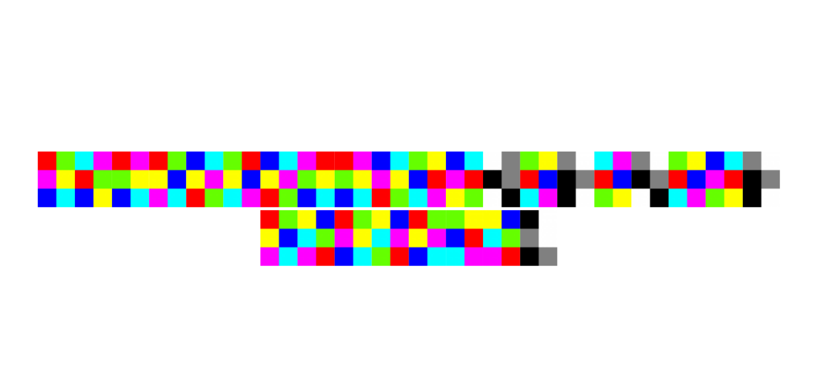
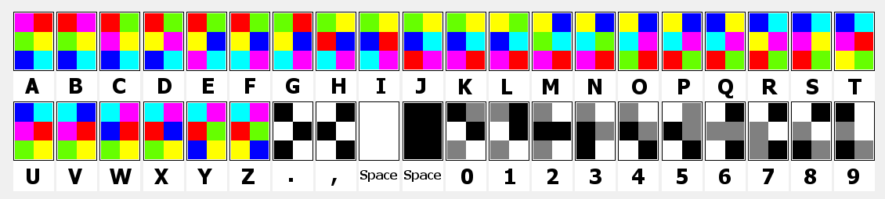
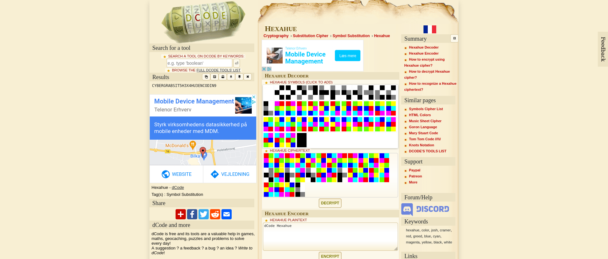

This is a challenge from Cyber Grabs CTF 0x03 CTF.

Challenge File: `ciphertext.pdf`

Category: Crypto

Description: Hex colors can make your life colourful.

This one went faster than I thought.

Doing a quick search for "color squares cipher", one of the first results was [Hexahue Cipher](https://www.dcode.fr/hexahue-cipher).

What is hexahue?

Invented by Josh Cramer, he wanted to create a unique alphabet with a combination of distinguishable colors. Hexahue uses the color red, green, blue... Colors that are simple to write in HTML notation. However, the alphabet contains letters, numbers and punctuation.

Hexahue is a form of monoalphabetic substitution cipher. It consists of 9 colors, each symbol written with a 2x3 grid of colors. Numbers are written with black, grey and white, while letters use the rest of the colors. A space can be written with either black or white and the text is usually written from left to right.

Adding the symbols one by one to match the cipher text of the challenge proved long, despite the simplicity of the task.

This will show `CYBERGRABSIT5H3X4HU3ENCODIN9` and to have the flag the content has to be separated by underscores (`_`).

The final flag in correct format is `In correct format: CYBERGRABS{IT5_H3X4HU3_ENCODIN9}`.
