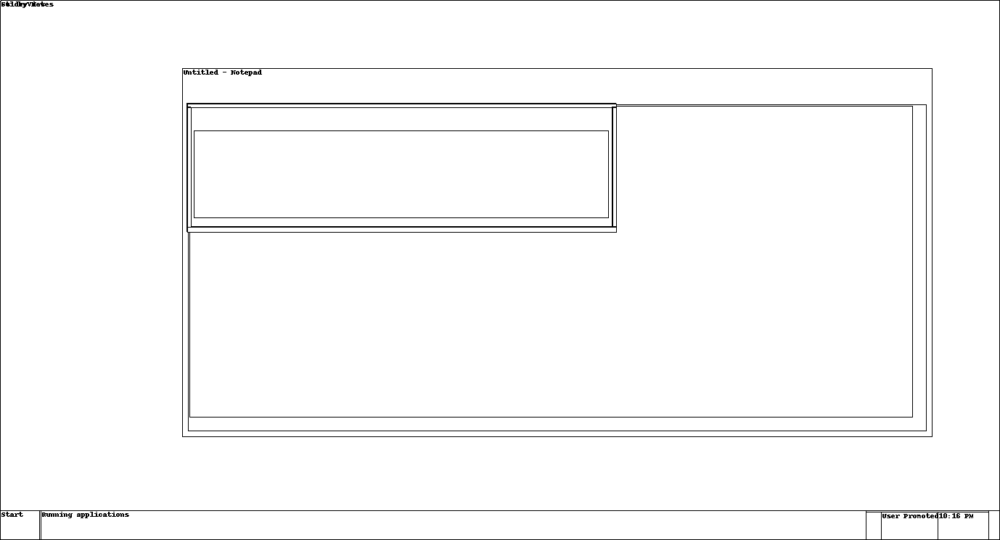
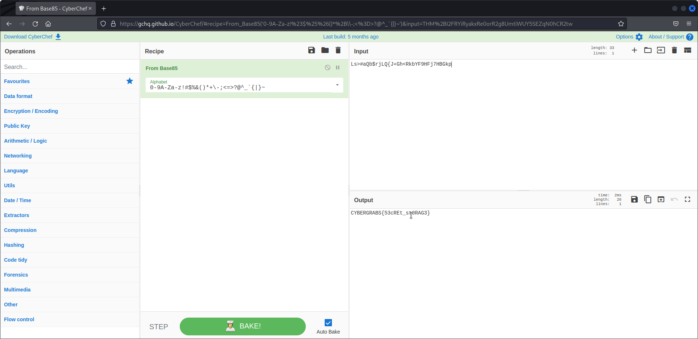

This is a challenge from Cyber Grabs CTF 0x03 CTF.


Challenge File: `memory.raw`

Category: Forensics

Description: Do you know Windows have a every secret storage location to have important message, but all of us uses it daily.


In forensics, files with a `.raw` extension normally end to be a memory dump that can be analyzed with [Volatility](https://www.volatilityfoundation.org/), an open source memory forensics framework for incident response and malware analysis.

Let's start with identifying the operating system of the raw image file. Now, the description mentions windows, but which profile will that be in Volatility?

```
$ ./volatility_2.6_lin64_standalone -f memory.raw imageinfo
Volatility Foundation Volatility Framework 2.6
INFO    : volatility.debug    : Determining profile based on KDBG search...
          Suggested Profile(s) : Win7SP1x64, Win7SP0x64, Win2008R2SP0x64, Win2008R2SP1x64_23418, Win2008R2SP1x64, Win7SP1x64_23418
                     AS Layer1 : WindowsAMD64PagedMemory (Kernel AS)
                     AS Layer2 : FileAddressSpace (/home/kali/Downloads/grabs/memory.raw)
                      PAE type : No PAE
                           DTB : 0x187000L
                          KDBG : 0xf800029fb130L
          Number of Processors : 1
     Image Type (Service Pack) : 1
                KPCR for CPU 0 : 0xfffff800029fd000L
             KUSER_SHARED_DATA : 0xfffff78000000000L
           Image date and time : 2022-02-03 16:46:27 UTC+0000
     Image local date and time : 2022-02-03 22:16:27 +0530
```

There is a handful of different suggested formats, but the first one will do.

The description mentions "Secret storage location to have important message". 

What can that be, a screenshot? Notepad? Sticky Notes...?

Let's start with screenshot and dump all those files in a directory.

```
$ ./volatility_2.6_lin64_standalone -f memory.raw --profile=Win7SP1x64 screenshot --dump-dir=memory
Volatility Foundation Volatility Framework 2.6
Wrote /home/kali/Downloads/grabs/memory/session_0.msswindowstation.mssrestricteddesk.png
Wrote /home/kali/Downloads/grabs/memory/session_0.Service-0x0-3e4$.Default.png
Wrote /home/kali/Downloads/grabs/memory/session_0.Service-0x0-3e5$.Default.png
Wrote /home/kali/Downloads/grabs/memory/session_0.Service-0x0-3e7$.Default.png
Wrote /home/kali/Downloads/grabs/memory/session_1.WinSta0.Default.png
Wrote /home/kali/Downloads/grabs/memory/session_1.WinSta0.Disconnect.png
Wrote /home/kali/Downloads/grabs/memory/session_1.WinSta0.Winlogon.png
Wrote /home/kali/Downloads/grabs/memory/session_0.WinSta0.Default.png
Wrote /home/kali/Downloads/grabs/memory/session_0.WinSta0.Disconnect.png
Wrote /home/kali/Downloads/grabs/memory/session_0.WinSta0.Winlogon.png
```

Looking through the images there is nothing but the `session_1.WinSta0.Default.png` shows us a high contrast theme.



Maybe trying with a memory dump, but it will extract everything of the process status at the time the raw image file was made.

```
./volatility_2.6_lin64_standalone -f memory.raw --profile=Win2008R2SP1x64_23418 memdump --dump-dir=memory
Volatility Foundation Volatility Framework 2.6
************************************************************************
Writing System [     4] to 4.dmp
************************************************************************
Writing smss.exe [   272] to 272.dmp
************************************************************************
Writing csrss.exe [   356] to 356.dmp
************************************************************************
Writing wininit.exe [   408] to 408.dmp
************************************************************************
Writing csrss.exe [   416] to 416.dmp
************************************************************************
Writing winlogon.exe [   472] to 472.dmp
************************************************************************
Writing services.exe [   492] to 492.dmp
************************************************************************
Writing lsass.exe [   500] to 500.dmp
************************************************************************
Writing lsm.exe [   508] to 508.dmp                                                                                 
************************************************************************                                            
Writing svchost.exe [   636] to 636.dmp
************************************************************************
Writing vm3dservice.ex [   700] to 700.dmp
************************************************************************
Writing svchost.exe [   724] to 724.dmp
************************************************************************
Writing svchost.exe [   776] to 776.dmp
************************************************************************
Writing svchost.exe [   868] to 868.dmp
************************************************************************
Writing svchost.exe [   904] to 904.dmp
************************************************************************
Writing svchost.exe [   936] to 936.dmp
************************************************************************
Writing svchost.exe [   284] to 284.dmp
************************************************************************
Writing svchost.exe [   900] to 900.dmp
************************************************************************
Writing spoolsv.exe [  1084] to 1084.dmp
************************************************************************
Writing svchost.exe [  1128] to 1128.dmp
************************************************************************
Writing svchost.exe [  1276] to 1276.dmp
************************************************************************
Writing VGAuthService. [  1396] to 1396.dmp
************************************************************************
Writing conhost.exe [  1420] to 1420.dmp
************************************************************************
Writing vmtoolsd.exe [  1460] to 1460.dmp
************************************************************************
Writing dllhost.exe [  1808] to 1808.dmp
************************************************************************
Writing msdtc.exe [  1892] to 1892.dmp
************************************************************************
Writing taskhost.exe [  1208] to 1208.dmp
************************************************************************
Writing WmiPrvSE.exe [  2180] to 2180.dmp
************************************************************************
Writing dwm.exe [  2248] to 2248.dmp
************************************************************************
Writing explorer.exe [  2272] to 2272.dmp
************************************************************************
Writing vm3dservice.ex [  2352] to 2352.dmp
************************************************************************
Writing vmtoolsd.exe [  2360] to 2360.dmp
************************************************************************
Writing SearchIndexer. [  2548] to 2548.dmp
************************************************************************
Writing svchost.exe [  1340] to 1340.dmp
************************************************************************
Writing TrustedInstall [  1864] to 1864.dmp
************************************************************************
Writing taskhost.exe [  1300] to 1300.dmp
************************************************************************
Writing audiodg.exe [  1860] to 1860.dmp
************************************************************************
Writing notepad.exe [  2820] to 2820.dmp
************************************************************************
Writing WmiPrvSE.exe [  1844] to 1844.dmp
************************************************************************
Writing StikyNot.exe [  1756] to 1756.dmp
************************************************************************
Writing SearchProtocol [  1416] to 1416.dmp
************************************************************************
Writing SearchFilterHo [  1516] to 1516.dmp
************************************************************************
Writing SearchProtocol [  2584] to 2584.dmp
************************************************************************
Writing mobsync.exe [  1960] to 1960.dmp
************************************************************************
Writing cmd.exe [  1424] to 1424.dmp
************************************************************************
Writing conhost.exe [   976] to 976.dmp
```

The dumps include Notepad and Sticky Notes, which could be a possibility.

I spent some time looking into the `dmp` files, finding a string saying "This is a something which is Secret" across the notepad process dump.

However, it is possible to directly search for those without having to analyze the dump file.

Instead, try with the following:

```
./volatility_2.6_lin64_standalone -f memory.raw --profile=Win7SP1x64 notepad 
Volatility Foundation Volatility Framework 2.6
ERROR   : volatility.debug    : This command does not support the profile Win7SP1x64
```

Which doesn't work, and neither do the rest...

Here is where cheat-sheets are the best way to go. Either this, or ask for help!

```
./volatility_2.6_lin64_standalone -f ~/Downloads/grabs/memory.raw --profile=Win7SP1x64 --help               1 ⨯
Volatility Foundation Volatility Framework 2.6
Usage: Volatility - A memory forensics analysis platform.

Options:
  -h, --help            list all available options and their default values.
                        Default values may be set in the configuration file
                        (/etc/volatilityrc)
  --conf-file=/home/kali/.volatilityrc
                        User based configuration file
  -d, --debug           Debug volatility
  --plugins=PLUGINS     Additional plugin directories to use (colon separated)
  --info                Print information about all registered objects
  --cache-directory=/home/kali/.cache/volatility
                        Directory where cache files are stored
  --cache               Use caching
  --tz=TZ               Sets the (Olson) timezone for displaying timestamps
                        using pytz (if installed) or tzset
  -f FILENAME, --filename=FILENAME
                        Filename to use when opening an image
  --profile=Win7SP1x64  Name of the profile to load (use --info to see a list
                        of supported profiles)
  -l file:///home/kali/Downloads/grabs/memory.raw, --location=file:///home/kali/Downloads/grabs/memory.raw
                        A URN location from which to load an address space
  -w, --write           Enable write support
  --dtb=DTB             DTB Address
  --shift=SHIFT         Mac KASLR shift address
  --output=text         Output in this format (support is module specific, see
                        the Module Output Options below)
  --output-file=OUTPUT_FILE
                        Write output in this file
  -v, --verbose         Verbose information
  -g KDBG, --kdbg=KDBG  Specify a KDBG virtual address (Note: for 64-bit
                        Windows 8 and above this is the address of
                        KdCopyDataBlock)
  --force               Force utilization of suspect profile
  -k KPCR, --kpcr=KPCR  Specify a specific KPCR address
  --cookie=COOKIE       Specify the address of nt!ObHeaderCookie (valid for
                        Windows 10 only)

        Supported Plugin Commands:

                amcache         Print AmCache information
                apihooks        Detect API hooks in process and kernel memory
                atoms           Print session and window station atom tables
                atomscan        Pool scanner for atom tables
                auditpol        Prints out the Audit Policies from HKLM\SECURITY\Policy\PolAdtEv
                bigpools        Dump the big page pools using BigPagePoolScanner
                bioskbd         Reads the keyboard buffer from Real Mode memory
                cachedump       Dumps cached domain hashes from memory
                callbacks       Print system-wide notification routines
                clipboard       Extract the contents of the windows clipboard
                cmdline         Display process command-line arguments
                cmdscan         Extract command history by scanning for _COMMAND_HISTORY
                consoles        Extract command history by scanning for _CONSOLE_INFORMATION
                crashinfo       Dump crash-dump information
                deskscan        Poolscaner for tagDESKTOP (desktops)
                devicetree      Show device tree
                dlldump         Dump DLLs from a process address space
                dlllist         Print list of loaded dlls for each process
                driverirp       Driver IRP hook detection
                drivermodule    Associate driver objects to kernel modules
                driverscan      Pool scanner for driver objects
                dumpcerts       Dump RSA private and public SSL keys
                dumpfiles       Extract memory mapped and cached files
                dumpregistry    Dumps registry files out to disk 
                editbox         Displays information about Edit controls. (Listbox experimental.)
                envars          Display process environment variables
                eventhooks      Print details on windows event hooks
                filescan        Pool scanner for file objects
                gahti           Dump the USER handle type information
                gditimers       Print installed GDI timers and callbacks
                getservicesids  Get the names of services in the Registry and return Calculated SID
                getsids         Print the SIDs owning each process
                handles         Print list of open handles for each process
                hashdump        Dumps passwords hashes (LM/NTLM) from memory
                hibinfo         Dump hibernation file information
                hivedump        Prints out a hive
                hivelist        Print list of registry hives.
                hivescan        Pool scanner for registry hives
                hpakextract     Extract physical memory from an HPAK file
                hpakinfo        Info on an HPAK file
                iehistory       Reconstruct Internet Explorer cache / history
                imagecopy       Copies a physical address space out as a raw DD image
                imageinfo       Identify information for the image 
                impscan         Scan for calls to imported functions
                joblinks        Print process job link information
                kdbgscan        Search for and dump potential KDBG values
                kpcrscan        Search for and dump potential KPCR values
                ldrmodules      Detect unlinked DLLs
                lsadump         Dump (decrypted) LSA secrets from the registry
                machoinfo       Dump Mach-O file format information
                malfind         Find hidden and injected code
                mbrparser       Scans for and parses potential Master Boot Records (MBRs) 
                memdump         Dump the addressable memory for a process
                memmap          Print the memory map
                messagehooks    List desktop and thread window message hooks
                mftparser       Scans for and parses potential MFT entries 
                moddump         Dump a kernel driver to an executable file sample
                modscan         Pool scanner for kernel modules
                modules         Print list of loaded modules
                multiscan       Scan for various objects at once
                mutantscan      Pool scanner for mutex objects
                netscan         Scan a Vista (or later) image for connections and sockets
                objtypescan     Scan for Windows object type objects
                patcher         Patches memory based on page scans
                poolpeek        Configurable pool scanner plugin
                pooltracker     Show a summary of pool tag usage
                printkey        Print a registry key, and its subkeys and values
                privs           Display process privileges
                procdump        Dump a process to an executable file sample
                pslist          Print all running processes by following the EPROCESS lists 
                psscan          Pool scanner for process objects
                pstree          Print process list as a tree
                psxview         Find hidden processes with various process listings
                qemuinfo        Dump Qemu information
                raw2dmp         Converts a physical memory sample to a windbg crash dump
                screenshot      Save a pseudo-screenshot based on GDI windows
                sessions        List details on _MM_SESSION_SPACE (user logon sessions)
                shellbags       Prints ShellBags info
                shimcache       Parses the Application Compatibility Shim Cache registry key
                shutdowntime    Print ShutdownTime of machine from registry
                ssdt            Display SSDT entries
                strings         Match physical offsets to virtual addresses (may take a while, VERY verbose)
                svcscan         Scan for Windows services
                symlinkscan     Pool scanner for symlink objects
                thrdscan        Pool scanner for thread objects
                threads         Investigate _ETHREAD and _KTHREADs
                timeliner       Creates a timeline from various artifacts in memory 
                timers          Print kernel timers and associated module DPCs
                truecryptmaster Recover TrueCrypt 7.1a Master Keys
                truecryptpassphrase     TrueCrypt Cached Passphrase Finder
                truecryptsummary        TrueCrypt Summary
                unloadedmodules Print list of unloaded modules
                userassist      Print userassist registry keys and information
                userhandles     Dump the USER handle tables
                vaddump         Dumps out the vad sections to a file
                vadinfo         Dump the VAD info
                vadtree         Walk the VAD tree and display in tree format
                vadwalk         Walk the VAD tree
                vboxinfo        Dump virtualbox information
                verinfo         Prints out the version information from PE images
                vmwareinfo      Dump VMware VMSS/VMSN information
                volshell        Shell in the memory image
                windows         Print Desktop Windows (verbose details)
                wintree         Print Z-Order Desktop Windows Tree
                wndscan         Pool scanner for window stations
                yarascan        Scan process or kernel memory with Yara signatures
```

Maybe there will be more luck with the clipboard!

```
$ ./volatility_2.6_lin64_standalone -f memory.raw --profile=Win7SP1x64 clipboard
Volatility Foundation Volatility Framework 2.6
Session    WindowStation Format                  Handle Object             Data                                              
---------- ------------- ------------------ ----------- ------------------ --------------------------------------------------
         1 WinSta0       CF_UNICODETEXT         0xb016f 0xfffff900c1b49360 Ls>#aQb$rjLQ{J+Gh<RkbYF9HFj7HBGkp                 
         1 WinSta0       CF_TEXT                    0x0 ------------------                                                   
         1 WinSta0       CF_LOCALE              0x700cf 0xfffff900c1ae3440                                                   
         1 WinSta0       0x0L                   0x0 ------------------   
```

Let's identify the string... Neither `base64`, `base68` nor `base32`. What about `base85`? The standard won't work but if changing a from the dropdown... 

Success!



Flag: `CYBERGRABS{53cREt_st0RAG3}`
